  

 

  
  &nbsp;
  

 

<h3><code>juanes@github ~ $ neofetch</code></h3>

 

<h3><code>juanes@github ~ $ cat sobre-mi.txt</code></h3>

Construyo **mezo**, un punto de venta para cafeterías, bares y restaurantes en Colombia.
No es un proyecto de portafolio: hay negocios cobrando con él todos los días, emitiendo
sus tickets y cuadrando su caja.

Hago producto, diseño y código. Me interesa menos la lista de tecnologías que la pregunta
que hay detrás de cada pantalla: *¿esto le sirve a alguien que está de pie, con fila,
a las 8 de la noche?*

No tengo título. Lo que sé lo aprendí construyendo, leyendo documentación y rompiendo
cosas en producción — y aprendiendo a no volver a romperlas.

 

<h3><code>juanes@github ~ $ cat como-trabajo.txt</code></h3>

**El diseño no es la capa de encima.** Un POS mal diseñado le cuesta segundos a un cajero
en cada venta, y esos segundos son la fila de la puerta. Cada decisión visual tiene que
justificarse en el mostrador, no en Dribbble.

**Lo que toca la plata se prueba, no se supone.** Un total mal calculado o una venta que
se puede editar después de cobrada no son bugs de interfaz: son plata. Van con reglas en
la base de datos, no solo con validación en el navegador.

**Lo que falla, que falle ruidoso.** Prefiero un error que se vea a un "guardado ✓" que
mienta. Un recibo que no se manda tiene que decirlo; un cierre de caja que no cuadra,
también.

 

<h3><code>juanes@github ~ $ ls -la ./proyectos</code></h3>

| | |
|---|---|
| **[mezo](https://mezopos.com)** | POS SaaS para gastronomía en Colombia. Mesas, cocina, inventario con recetas, menú QR con autopedido, facturación DIAN y reportes en lenguaje natural. En producción. |
| **SmartICFES** | Plataforma de preparación para el examen de Estado. |
| **CRUX** | PWA de hábitos — un lado personal, más pequeño y más terco. |

 

<h3><code>juanes@github ~ $ ./contributions.sh</code></h3>

  <picture>
    <source media="(prefers-color-scheme: dark)" srcset="https://raw.githubusercontent.com/JuanesLizcano/JuanesLizcano/output/github-contribution-grid-snake-dark.svg" />
    <source media="(prefers-color-scheme: light)" srcset="https://raw.githubusercontent.com/JuanesLizcano/JuanesLizcano/output/github-contribution-grid-snake.svg" />
    
  </picture>

 

  <code>hero.svg</code> y <code>stack.svg</code> están hechos a mano en este repo — SVG con animación propia, sin servicios de terceros ni fuentes externas.

